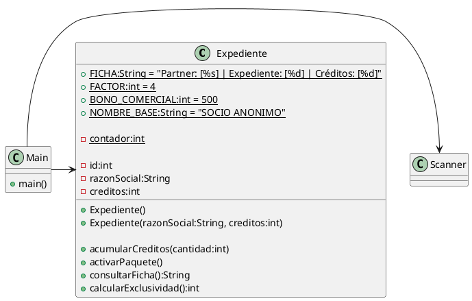

# Diagrama de Clases y ordinograma


```plantuml
@startuml
class Expediente{
    +{static} FICHA:String = "Partner: [%s] | Expediente: [%d] | Créditos: [%d]"
    +{static} FACTOR:int = 4
    +{static} BONO_COMERCIAL:int = 500
    +{static} NOMBRE_BASE:String = "SOCIO ANONIMO"

    -{static}contador:int

    -id:int
    -razonSocial:String
    -creditos:int

    +Expediente()
    +Expediente(razonSocial:String, creditos:int)

    +acumularCreditos(cantidad:int)
    +activarPaquete()
    +consultarFicha():String
    +calcularExclusividad():int

}

class Main{
    +main()
}

class Scanner{}
Main->Scanner
Main->Expediente
@enduml


```

```mermaid
```

